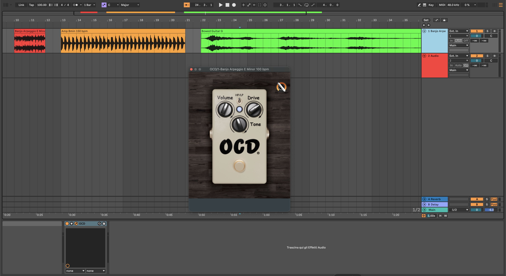

# Explicit Wave Digital Model of the Fulltone OCD Pedal Based on Canonical Piecewise-Linear Functions

This repository is meant as a companion page for the paper **Explicit Wave Digital Model of the Fulltone OCD Pedal Based on Canonical Piecewise-Linear Functions**, authored by R. Giampiccolo, S. Polimeno, A. Lenoci, C. Macrì, O. Massi, and A. Bernardini, and accepted at the _29th International Conference on Digital Audio Effects (DAFx)_, Cambridge, MA, USA, 1-4 September 2026. .

**Abstract**: Virtual Analog (VA) modeling aims at digitally emulating analog audio equipment while preserving its characteristic nonlinear behavior and musical expressiveness. In this paper, we present an explicit Wave Digital (WD) model of the Fulltone OCD (v2) overdrive pedal based on Canonical Piecewise-Linear (CPWL) functions. By approximating the MOSFET-based asymmetric clipping stage as a single nonlinear element, the proposed model avoids costly iterative solvers while maintaining high accuracy. The resulting implementation achieves real-time performance with significantly lower computational cost than conventional iterative Wave Digital approaches. The repository includes both a MATLAB implementation of the proposed model and a JUCE-based real-time audio plug-in.

## Files

The repository contains the following main folders:

- `MATLAB/`: MATLAB implementation of the explicit Wave Digital model, including all the functions required to simulate the Fulltone OCD pedal and reproduce the results presented in the accompanying paper.
- `Plug-in/`: JUCE implementation of the Fulltone OCD audio plug-in.

## Usage

To utilize the MATLAB implementation, clone the repository and execute the main script located in the `MATLAB` folder. All the required functions are included to simulate the Fulltone OCD pedal in the Wave Digital domain.

## Plug-in

A real-time audio plug-in implementing the proposed explicit Wave Digital model is available in the `Plug-in` folder. The plug-in is built using the [JUCE framework](https://juce.com) and provides an efficient real-time emulation of the Fulltone OCD overdrive pedal based on the 1NL approximation (using Canonical Piecewise-Linear functions).



## Citation

If you use this repository in your research, please cite:

```bibtex
@inproceedings{giampiccolo2026fulltone,
  author    = {Riccardo Giampiccolo and Stefano Polimeno and Carlo Macrì and Alice Lenoci and Oliviero Massi and Alberto Bernardini},
  title     = {Explicit Wave Digital Model of the Fulltone OCD Pedal Based on Canonical Piecewise-Linear Functions},
  booktitle = {Proceedings of the 29th International Conference on Digital Audio Effects (DAFx-26)},
  year      = {2026},
  address   = {Cambridge, MA, USA},
  month     = {Sept}
}
```
